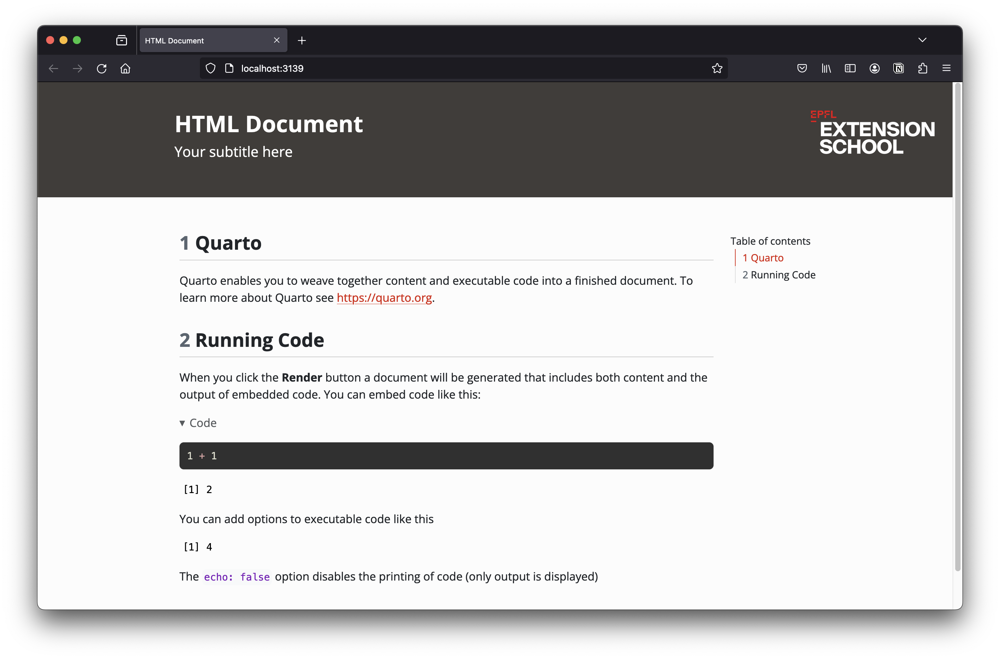

# Quarto Assets for the EPFL DEXTS <a href="https://www.epfl.ch/education/continuing-education/"></a>

This repo contains a series of assets to create documents with the
Digital Extension School visual identity.

## HTML Documents

- To create an HTML document, you can copy the YAML of the html document
  [in this template.](./templates/document.qmd)
- This template contains a header that references:
  - the [`styles-html.css`](./themes/styles-html.css) style sheet
  - the [logos](./logos) contained in this repo



## Slide Decks (revealjs)

- To create a slide deck, copy the YAML [in this
  template.](./templates/slides.qmd)

- It references the [`exts-reveal.css`](./themes/exts-reveal.css)
  stylesheet, which is compiled from
  [`exts-reveal.scss`](./themes/exts-reveal.scss):

  ``` bash
  sass themes/exts-reveal.scss themes/exts-reveal.css
  ```

  **Re-run that command after every edit to the `.scss`** — the `.css`
  is what the decks actually load, and it is committed rather than built
  on demand.

- Two ways to consume it:

  |  | `css:` (recommended) | `theme:` |
  |------------------------|------------------------|------------------------|
  | What you write | `css: https://epfl-exts.github.io/exts-quarto-assets/themes/exts-reveal.css` | `theme: [default, exts-reveal.scss]` |
  | Remote URL? | yes | **no** — Quarto needs a local path, so vendor a copy of the `.scss` next to the deck |
  | What applies | the `scss:rules` section | the whole file, including Sass variables like `$presentation-heading-color` |

- The stylesheet provides `.content-box-marine`, `.content-box-oil`,
  `.content-box-white`, the `.subsection` / `.subsubsection`
  section-divider classes, and `.tiny` / `.small`. Use them as fenced
  divs:

  ``` markdown
  ::: {.content-box-marine}
  The point you want the room to remember.
  :::
  ```

### A note on the brand green

`$exts-marine` (`#00a79f`) is the teal the older workshop decks were
built against; `$exts-discover-turquoise` (`#35d48d`) is the 2023
identity green. They are deliberately kept as separate variables —
`.content-box-marine` still uses the former so ported decks look
unchanged. Switch it when the slides are re-branded.
